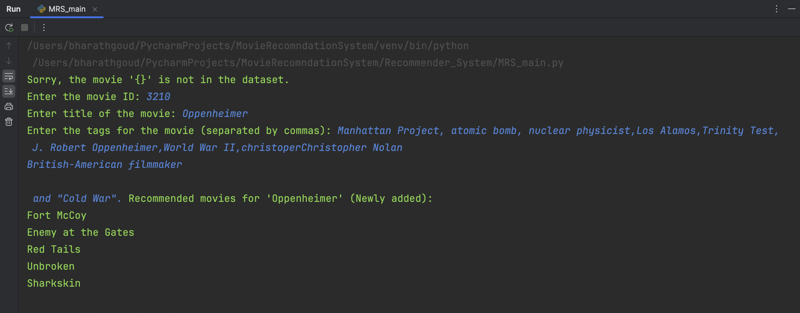

# Movie Recommendation System

## Time Line           January 2024 -  April 2024

---

## 📑 Table of Contents

1. [Introduction](#introduction)
2. [Features](#features)
3. [Implementation Details](#implementation-details)
4. [How to Use](#how-to-use)
5. [Example Usage](#example-usage)
6. [Future Improvements](#future-improvements)

---

## Introduction
Recommendation system is a subcategory of information filtering system that recommends appropriate items to users according to their choice. There are three broad categories of filtering:

1) **Content-Based Filtering** - The system recommends items that are similar to what the user liked or used before.
2) **Collaborative Filtering** - The system makes recommendations based on the tastes of similar users. Items that were highly rated by users with the same tastes are recommended.
   - **User-Based Collaborative Filtering** - Suggests items to a user based on the tastes of other users having the same interest.
- **Item-Based Collaborative Filtering** - Suggests items to a user based on items with similarities to those items the user has previously rated.
3) **Hybrid Filtering** - Merges Content-Based Filtering and Collaborative Filtering.

My plan is to create a **Movie Recommendation System**, which is a content-based recommendation system that recommends movies of similar kind on the basis of user input. The system makes use of **Natural Language Processing (NLP)** algorithms like tokenization, stemming, and cosine similarity for analyzing and comparing movie metadata. The project is developed in **Python** using libraries such as `pandas`, `sklearn`, and `nltk`.

## Features
- **Data Preprocessing**: Cleans and formats raw movie datasets.
- **Feature Engineering**: Extracts meaningful features like genres, cast, crew, and keywords.
- **Text Processing**: Transforms metadata to machine-readable form using stemming and vectorization.
- **Cosine Similarity**: Calculates similarity between movies based on text features.
- **User Interaction**: Provides the facility to search movies and obtain recommendations.
- **Movie Addition**: Provides the facility to add new movies dynamically to the dataset.

## Dataset
The project utilizes two datasets from the **[TMDB 5000 Movie Dataset](https://www.kaggle.com/datasets/tmdb/tmdb-movie-metadata)**:
- `tmdb_5000_movies.csv`
- `tmdb_5000_credits.csv`

These datasets have different metadata like the title of the movies, genres, cast, crew, and keywords.

## Installation
Install the required libraries using:
```sh
pip install numpy pandas nltk scikit-learn
```

## Implementation Details
### 1. Data Loading & Merging
The datasets are loaded with `pandas.read_csv()`, and then merged based on the `title` column.
```python
RawMovies = pd.read_csv("tmdb_5000_movies.csv")
RawCredits = pd.read_csv("tmdb_5000_credits.csv")
MergeDF = pd.merge(RawMovies, RawCredits, on='title')
```

### 2. Feature Selection & Cleaning
 Selecting the required columns and remove missing values:
```python
RequiredColumnDF = MergeDF[['movie_id', 'title', 'overview', 'keywords', 'genres', 'cast', 'crew']]
RequiredColumnDF = RequiredColumnDF.dropna(subset=['overview'])
```

### 3. Data Transformation
In the dataset, there are JSON-like lists in a few columns (`genres`, `keywords`, `cast`, `crew`). These are transformed into structured lists using `ast.literal_eval()`.
```python
def convert(input_string):
    return [i['name'] for i in ast.literal_eval(input_string)]
RequiredColumnDF['genres'] = RequiredColumnDF['genres'].apply(convert)
```
For the cast, only the first 3 actors are taken, and only the director is taken from the crew.

### 4. Feature Engineering
A new column **tags** is added, which is a concatenation of all textual information that is relevant:
```python
RequiredColumnDF['tags'] = RequiredColumnDF['genres'] + RequiredColumnDF['cast'] + RequiredColumnDF['crew'] + RequiredColumnDF['keywords'] + RequiredColumnDF['overview']
MoviesDF = RequiredColumnDF[['movie_id', 'title', 'tags']]
MoviesDF['tags'] = MoviesDF['tags'].apply(lambda x: " ".join(x).lower())
```

### 5. Text Processing & Vectorization
The `tags` column is converted into numerical vectors with **CountVectorizer**:
```python
from sklearn.feature_extraction.text import CountVectorizer
```
cv = CountVectorizer(max_features=5000, stop_words='english')
vectors = cv.fit_transform(MoviesDF['tags']).toarray()
```

**Stemming** is used to normalize words:
```python
from nltk.stem.porter import PorterStemmer
Ps = PorterStemmer()
def stem(input_text):
    return " ".join([Ps.stem(i) for i in input_text.split()])
MoviesDF['tags'] = MoviesDF['tags'].apply(stem)
```

### 6. Computing Similarity
**Cosine similarity** is computed to get similar movies:
```python
from sklearn.metrics.pairwise import cosine_similarity
similarity = cosine_similarity(vectors)
```

### 7. Movie Recommendation Function
A function is created to recommend movies on the basis of user input:
```python
def RecommendMovies(movie, MoviesDF, similarity):
    movie_indices = MoviesDF[MoviesDF['title'] == movie].index
```
if len(movie_indices) == 0:
        print("Movie not found! Consider adding it.")
    else:
        movie_index = movie_indices[0]
        distance = similarity[movie_index]
        movies_list = sorted(list(enumerate(distance)), reverse=True, key=lambda x: x[1])[1:6]
print("Recommended movies for '{}':".format(movie))
        for i in movies_list:
            print(MoviesDF.iloc[i[0]].title)

### 8. Adding New Movies
If a movie is not found in the dataset, users can manually add it:
```python
def AddMovie(movie_id, title, tags, MoviesDF):
    new_movie = {'movie_id': [movie_id], 'title': [title], 'tags': [tags]}
MoviesDF = pd.concat([MoviesDF, pd.DataFrame(new_movie)], ignore_index=True)
    return MoviesDF
``` 

## How to Use
1. Execute the script and input a movie name (`MRS_main.py`).
2. If the movie is present, it will suggest five similar movies.
3. If the movie is not present, you can input its details manually.

## Example Usage  
- **Movie within the dataset:**
  ```python
  MoviesDF, similarity = RecommendMovies('Avatar', MoviesDF, similarity)
  MoviesDF.to_csv('MoviesDF.csv', index=False)
    ``` 
    

- **Movie added to the dataset:**
  ```python
  MoviesDF, similarity = RecommendMovies('Oppenheimer', MoviesDF, similarity)
  MoviesDF.to_csv('MoviesDF.csv', index=False)
    ```
  
  

## Future Improvements  
- Implement a **user-based collaborative filtering** model.  
- Integrate a **web interface** for better user experience.  
- Allow users to rate and review movies.  
- Enhance vectorization techniques using **TF-IDF**.  

